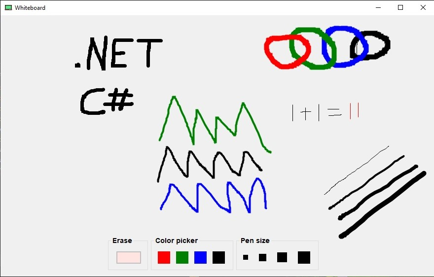

# Whiteboard App

* A simple whiteboard application built using .NET Windows Forms with C#. It allows users to draw freely with different color and line thicknesses.

---

---

## Features
1. Write and draw freely using the mouse.
2. Change line thickness
3. Change colors
4. Smooth drawing experience.
5. Clear the whiteboard using the eraser button.

## Installation
1. Clone the repository.
2. Open the project in Visual Studio.
3. Build and run the application. 

